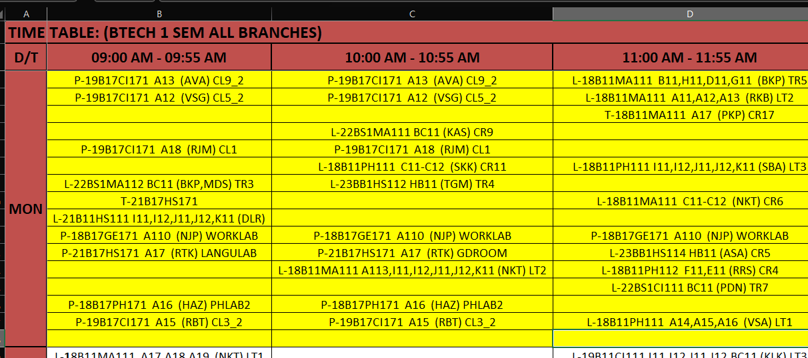
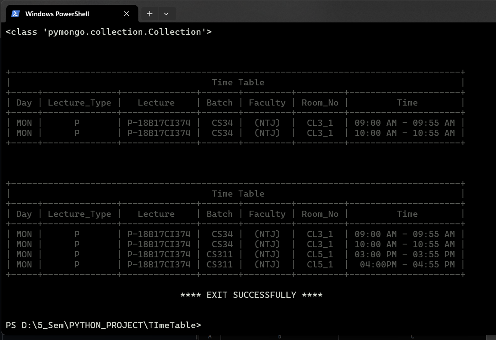

# Schedule-Finder

 - This is a tool that helps the students and the faculties to easily find their scheduled lectures according to the Queries/
 filters applied by the user through the GUI.
 - The university provides the Time Table for all the batches in the form of single excel spreadsheet where it is difficult to
 manage and  find the schedule for required day, batch, faculty.
-----
### Technologies Used: 

-  Tkinter(py Lib)
-  Pandas (py Lib)
-  openpyxl(py Lib)
-   MongoDB
-   Python
  
-----

### How it Was !
  

<!--    -->
 
<!--    -->

-----
###  How it is NOW  ? 

- ### GUI

   
<!--  -->

<!--    -->

- ### After Pressing *Show*

  
<!--  -->
<!--  -->

  

  

